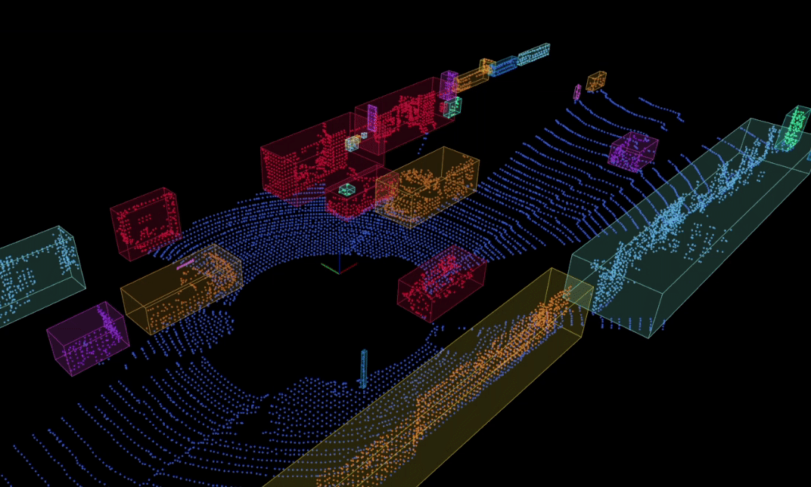

# lidar_obstacle_detector

3D LiDAR Object Detection &amp; Tracking using Euclidean Clustering &amp; Hungarian algorithm

[](https://www.codefactor.io/repository/github/ss47816/lidar_obstacle_detector)





## Features
* Segmentation of ground plane and obstacle point clouds
* Customizable Region of Interest (ROI) for obstacle detection
* Customizable region for removing ego vehicle points from the point cloud
* Tracking of obstacles between frames using IOU gauge and Hungarian algorithm
* In order to help you tune the parameters to suit your own applications better, all the key parameters of the algorithm are controllable in live action using the ros param dynamic reconfigure feature

**TODOs**
* LiDAR pointcloud motion undistortion
* Drive Space/Kurb Segmentation
* Refine PCA Bounding Boxes by L-Shape fitting
* Add trackers such as UKF

**Known Issues**
* PCA Bounding Boxes might not be accurate in certain situations

## Dependencies
* autoware-msgs
* jsk-recognition-msgs

## Installation
```bash
# clone the repo
cd catkin_ws/src
git clone https://github.com/SS47816/lidar_obstacle_detector.git

# install dependencies & build 
cd ..
rosdep install --from-paths src --ignore-src -r -y
catkin_make
source devel/setup.bash
```

## Usage

### 1. (Easy) Use this pkg with ROS Bags (`mai_city` dataset as an example here)


**Step 1**: Download the `mai_city` dataset from their [Official Website](https://www.ipb.uni-bonn.de/data/mai-city-dataset/)

**Step 2**: Launch the nodes using the `mai_city.launch` launch file
```bash
# this will launch the obstacle_detector node, rviz, and rqt_reconfigure GUI together
roslaunch lidar_obstacle_detector mai_city.launch
```

**Step 3**: Run any of the bags from the dataset
```bash
# go to the folder where the dataset is located
cd mai_city/bags
# play the rosbag
rosbag play 00.bag
```

### 2. Use this pkg with LGSVL Simulator (with the help of the [`lgsvl_utils`](https://github.com/SS47816/lgsvl_utils) pkg)


**Step 1**: Launch the LGSVL simulator and `lgsvl_utils` nodes 
> Please refer this step to the [`README` Usage Section](https://github.com/SS47816/lgsvl_utils) of the `lgsvl_utils` pkg

**Step 2**: Launch the nodes using the `launch/lgsvl.launch` launch file
```bash
# launch node
roslaunch lidar_obstacle_detector lgsvl.launch 
```

## Contribution
You are welcome contributing to the package by opening a pull-request

We are following: 
[Google C++ Style Guide](https://google.github.io/styleguide/cppguide.html), 
[C++ Core Guidelines](https://isocpp.github.io/CppCoreGuidelines/CppCoreGuidelines#main), 
and [ROS C++ Style Guide](http://wiki.ros.org/CppStyleGuide)

## License
MIT License